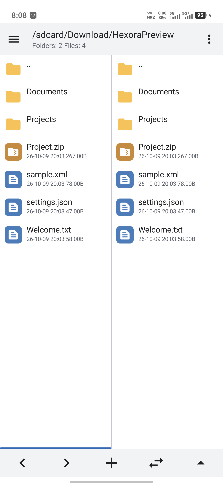
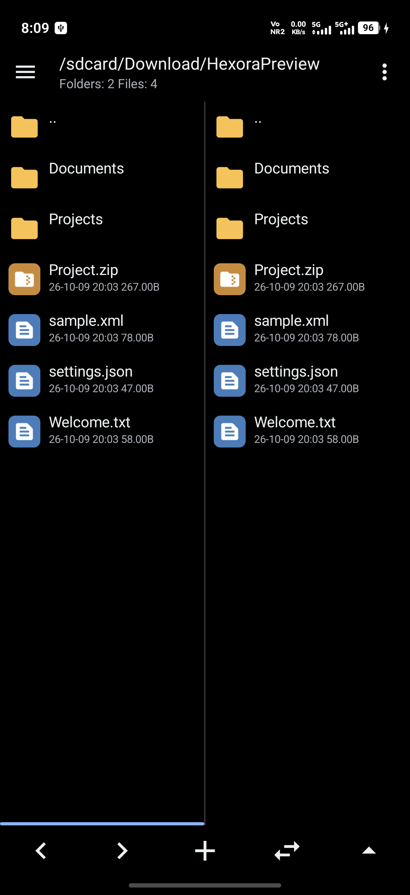

# Hexora


An Android dual-pane file manager with archive browsing, a built-in editor,
and APK tools. Hexora is developed by [ZENIN](https://github.com/ZENINXOP),
based on the open-source [MP-Manager](https://github.com/AbdurazaaqMohammed/MP-Manager).

[Repository](https://github.com/ZENINXOP/Hexora) ·
[Releases](https://github.com/ZENINXOP/Hexora/releases) ·
[Report an issue](https://github.com/ZENINXOP/Hexora/issues)

**Latest release:** [Hexora 0.1.1](https://github.com/ZENINXOP/Hexora/releases/tag/v0.1.1) ·
[Download APK](https://github.com/ZENINXOP/Hexora/releases/download/v0.1.1/Hexora.0.1.1.apk)

## Screenshots

<p align="center">
  
  
</p>

Captured directly from the owner's phone on October 9, 2026, using Hexora
0.1.0 and demo files. These show the installed version; subsequent local source
changes will appear after the next build and installation.

## Features

- Two file panes with independent navigation, bookmarks, history, filtering,
  sorting, and multi-selection.
- ZIP and APK browsing, file editing inside archives, compression, and extraction.
- Text, XML, Smali, DEX, and resource tools, plus APK information and installation.
- Built-in image viewing and audio/video playback.
- Root and Shizuku support for locations requiring elevated access.
- Light, dark, black, and system themes, with configurable file rows and menus.

## ZIP files

Tap a ZIP to browse its folders. Long-press a ZIP and choose **Extract ZIP**
to unpack it into a new folder beside the archive. If that folder name already
exists, Hexora chooses an unused name rather than merging into it.

The current source indexes archive folders once and reuses parsed headers for
navigation and file opening. Archive reads and XML resource parsing run in the
background. Cached metadata is refreshed when an archive changes or is manually
refreshed. ZIP regression tests cover folder navigation, repeated reads,
concurrent pane requests, and cache invalidation.

## Building

Use **JDK 17**, the included **Gradle 8.13** wrapper, and Android SDK platform 36.
In Android Studio, select JDK 17 as the **Gradle JDK**. Java 25 is incompatible
with this project's Gradle version.

Set `sdk.dir` in an untracked `local.properties`, then run:

```sh
./gradlew :app:assembleDebug
```

Application ID: `app.hexora.manager`. The upstream Java namespace is retained
for source and extension compatibility. Hexora uses its own preferences,
provider authorities, and export directory.

The updater remains inactive until `UPDATE_REPOSITORY` in `app/build.gradle`
is configured for Hexora. Release APK filenames must start with `Hexora.`.

## Credits and license

- **ZENIN / ZENINXOP** — Hexora project owner.
- **OpenAI Codex** — AI-assisted UI, branding, and performance development.
- **Abdurazaaq Mohammed and MP-Manager contributors** — the original app and
  file-management foundation.
- Third-party library authors — see the in-app About screen and upstream notices.

See [CONTRIBUTORS.md](CONTRIBUTORS.md) for attribution. Hexora retains the
upstream [GPL-3.0 license](LICENSE) and notices. Further background and feature
documentation are available in the [upstream project](https://github.com/AbdurazaaqMohammed/MP-Manager).
