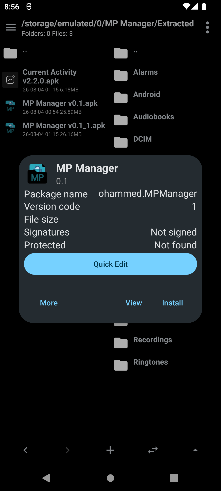
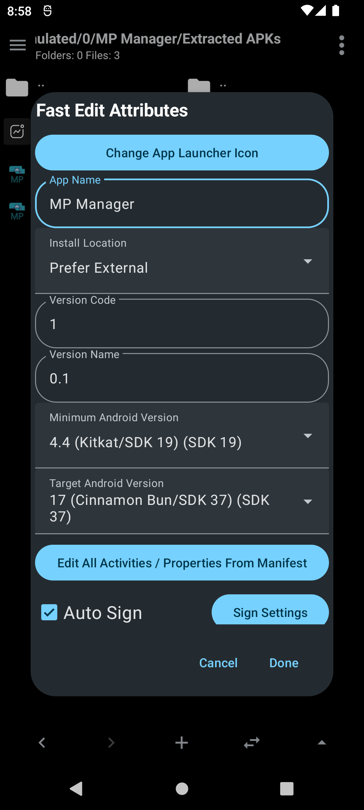
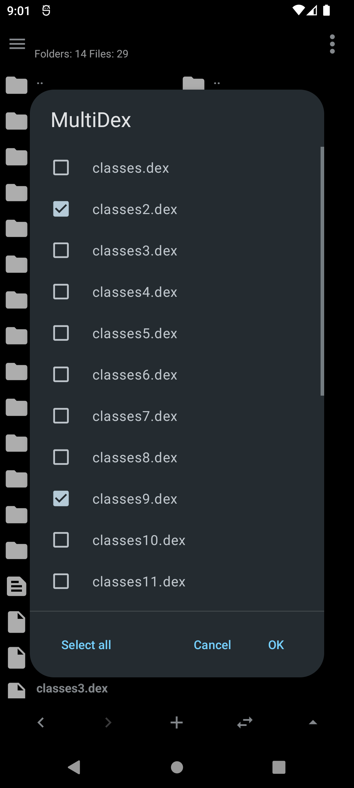
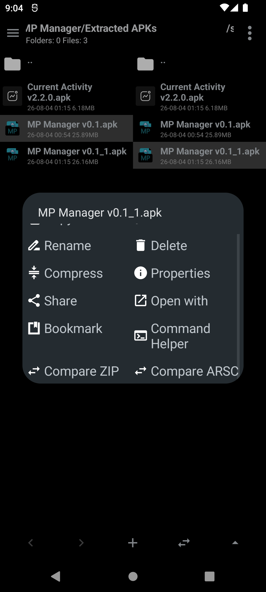
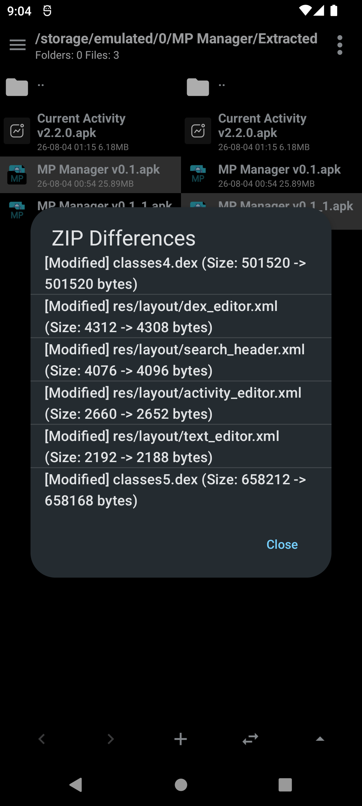
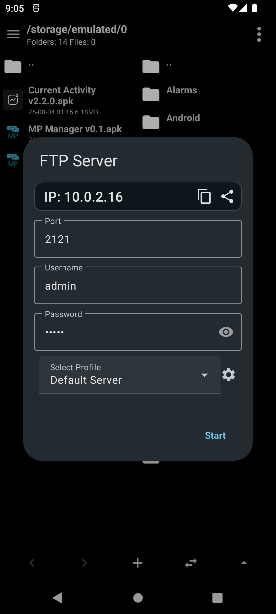
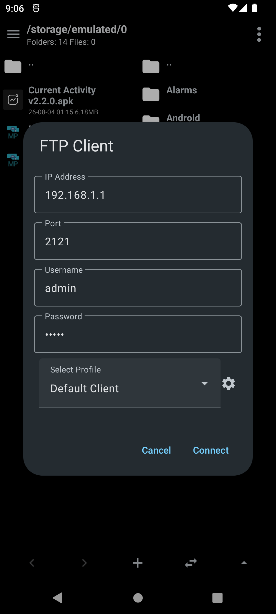
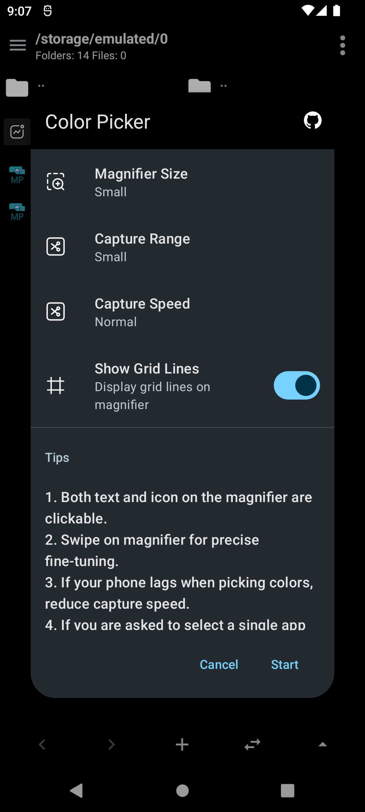
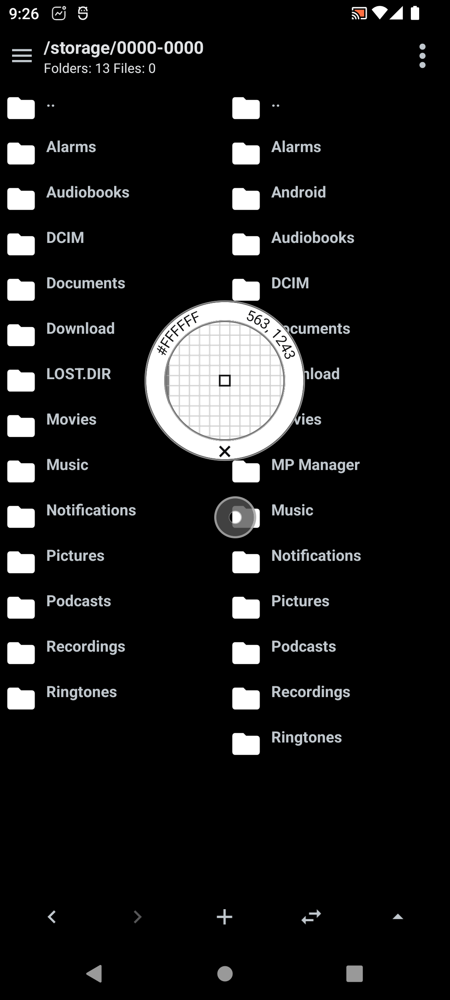
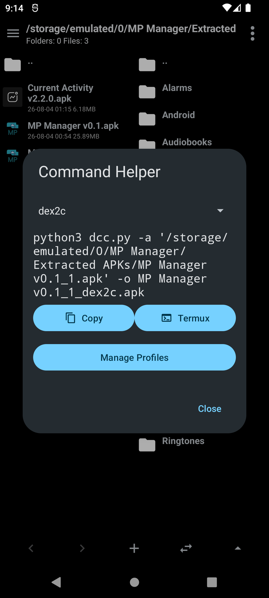

# Hexora

[GitHub repository](https://github.com/ZENINXOP/Hexora)

Hexora is an Android dual-pane file manager based on
[MP-Manager](https://github.com/AbdurazaaqMohammed/MP-Manager).

This first pass adds an original hexagon/H launcher icon, consistent light and
dark themes (including system-following mode), compact file rows, a pane divider,
larger toolbar touch targets, and UI-thread fixes for startup and file-row binding.
The MT Manager visual reference is pending screenshots; exact parity is not yet
claimed. No runtime performance benchmark has been completed yet.

Application ID: `app.hexora.manager`. The original Java namespace and plugin
action names are retained for source and extension compatibility. Hexora uses its
own provider authorities and `Hexora` export/framework directory. It does not
migrate MP-Manager preferences or files automatically.

The app updater is inactive until `UPDATE_REPOSITORY` in `app/build.gradle` is
set to Hexora's GitHub `owner/repository`. It will not offer MP-Manager APKs as
Hexora updates. Release APK filenames must start with `Hexora.`.

## Build

The wrapper uses Gradle 8.13. Use JDK 17 and Android SDK platform 36.
Set `sdk.dir` in an untracked
`local.properties`, then run:

```sh
./gradlew :app:assembleDebug
```

## Credits

See [CONTRIBUTORS.md](CONTRIBUTORS.md), the in-app About screen, and the upstream
documentation below. OpenAI Codex is credited for AI-assisted development.
The upstream GPL-3.0 license and notices are retained; see [LICENSE](LICENSE).

---

## Upstream documentation

#  MP Manager

A free dual pane, Material Design file manager for Android with focus on APKs and the goal to be an open source alternative to MT Manager

<p align="center">
   
</p>

[](https://github.com/AbdurazaaqMohammed/MP-Manager/releases)

[](https://t.me/MP_Manager_Discussion)
## Features

### File Manager

<details><summary>Dual pane navigation</summary>

Browse two folders side by side. This makes it easy to move or copy files from one pane to the other.

A separate home folder can be set for each pane. The active pane can be highlighted with a colored border, optionally animated.

There are back and forward buttons, button to sync both panes to the same folder, new file/folder button, parent folder button. You can pull down to refresh the current folder.

<!-- TODO: Add video

-->
</details>

<details><summary>Bookmarks and history</summary>

Add any folder to bookmarks and manage them from a bottom drawer. The drawer has tabs for bookmarks and navigation history and opens by swiping up on the bottom bar.

Bookmarks can be organized into groups, edited, and deleted by long pressing on one. You can choose which tab new bookmarks go to, and optionally show bookmarks and bookmark groups in the sidebar.

<p align="center">
  
  <br>
  <em>The bookmarks and history drawer</em>
</p>
</details>

<details><summary>Filtering, sorting and hidden files</summary>

Filter the current folder as you type. Sort by name, size, date or type, reverse order, and choose whether a sort applies only to the current folder or everywhere. You can hide files from the list, show or hide system hidden files such as dot folders, and edit the list of manually hidden files later.

<p align="center">
    
  <br>
  <em>Filter the current folder</em> &nbsp;·&nbsp; <em>Choose a sorting mode</em> &nbsp;·&nbsp; <em>Hide files from the list</em>
</p>
</details>

<details><summary>Advanced search</summary>

Search the current folder by file name and optionally recurse into subfolders. Advanced options include match case, regular expressions, searching for text inside file contents, and minimum or maximum file size. Recent searches are saved for quick reuse.

Content search can also be run over an entire folder from the menu, reporting the number of matches in each file. A list of paths can be set to be excluded from searching.

<p align="center">
  
  <br>
  <em>The advanced search dialog</em>
</p>
</details>

<details><summary>File operations</summary>

Create files and folders, rename, copy, move and delete with progress reporting.

Extract, add files in ZIP, APK. Compression option when modifying ZIPS + auto sign and zipalign for APKs.

Rename several files at once using templates with prefix, suffix, numbering and find/replace.

When a destination file already exists, each conflict can be resolved with replace, skip or rename, applied to all remaining files, or added to an existing archive. Copies can keep the original modification date. Renaming several files previews the new names before they are applied, and in multi select mode swiping across two files selects every file between them.

The MIME type detected from the file contents is shown before sharing or opening a file, and a default app can be set or cleared for a file type.

Files received from other apps can be saved from the share menu. Unknown files can be opened with a custom app from the Open with dialog.

Shell scripts can be viewed, edited or executed with the output and exit code shown, optionally with root.

<!-- TODO: Add screenshots/videos


-->
</details>

<details><summary>File properties and sharing</summary>

View type, size and last modified date, and copy any value to the clipboard with a long press. Share files or open them with another app.

With root, file permissions can be edited, including owner, group, the read, write and execute bits for each, and the setuid, setgid and sticky flags.

Checksums can be computed for any file, pasted hashes can be verified, and hashes of two files can be compared. ZIP entries have CRC32 and checksum support.

<!-- TODO: Add screenshots/videos -->
</details>

<details><summary>Root and Shizuku file management</summary>

Browse and manage files with root or Shizuku, including Android/data, obb and media on Android 11+. With Shizuku you can also open other locations the shell can read but the app cannot, such as /storage/emulated and system folders, read-only where modification is not permitted. Root listing is cached for speed, commands are safe on paths with spaces, and editors write back through root when needed.

In root or Shizuku mode the root directory is added to the sidebar.

<!-- TODO: Add screenshots/videos -->
</details>

<details><summary>Customizable file menu</summary>

Reorder the long press file menu by dragging items anywhere. The menu can be shown as a bottom sheet or in two columns, with Material colors.

<!-- TODO: Add screenshots/videos -->
</details>

### Media

<details><summary>Built-in audio and video player</summary>

Play audio and video files without leaving the app. A mini player dialog with artwork, seek bar and playback controls can play in the background or expand into a full player.

Player settings allow the screen to be kept on while playing and the skip duration to be changed.

<!-- TODO: Add screenshots/videos


-->
</details>

<details><summary>Image viewer</summary>

Open images with swipe between pictures in directory. EXIF metadata is shown for supported files, images can be deleted or shared from the viewer.

The built-in image editor can crop single or multiple images with standard or lossless JPEG quality, and view or edit EXIF tags in single or batch mode. The editor also rotates and flips images, crops to a custom aspect ratio, and strips EXIF and other metadata from JPEG files.

<!-- TODO: Add screenshots/videos

-->
</details>

### APK Tools

<details><summary>APK information and install</summary>

Tap an APK to see its icon, name, version code and name, package name, signature schemes used (V1, V2, V3, V4) and whether it is protected. You can view files inside the APK and more features outlined below.

Installing both regular and split APKS is supported.

For installed packages APK and data directory are also shown with root.

<p align="center">
  
  <br>
  <em>The APK info dialog</em>
</p>
</details>

<details><summary>Sign APK and split APKs</summary>

Sign APKs and split APKs with your own or default (Debug) key. Signing supports JKS and PKCS12 keystores as well as PK8/PEM keys, and new keys can be generated inside the app.

Automatic signing after modifying an APK can be toggled and configured. For safety with keys that have passwords, it is required to authenticate each time before signing but biometrics can be used as alternative to entering password every time.

<!-- TODO: Add screenshots/videos

-->
</details>

<details><summary>Toast/Dialog Maker</summary>

Add a Toast or dialog message to activities in an APK, or remove all Toast calls from an APK at once by patching smali code.

<!-- TODO: Add screenshots/videos -->
</details>

<details><summary>Decompile, build and protect</summary>

All functions from [REAndroid APKEditor](https://github.com/REAndroid/APKEditor) are available: Decompile an APK, Build an APK from a decompiled folder, merge (AntiSplit), Refactor obfuscated resource names and Protect.

When merging split APKs the splits to include can be chosen, device specific splits can be kept or dropped, a compression level can be set, and the merged APK can be signed automatically. Other tools options can also be configured before starting.

<p align="center">
  
  <br>
  <em>Decompiling</em>
</p>
</details>

<details><summary>Quick edit APK attributes</summary>

Change the launcher icon, app name, install location, version code and name, min SDK and target SDK quickly in a dialog. Every activity and property in the manifest can also be edited from a tree view, including disabling entries. A .bak backup is created upon edit and can be restored.

<p align="center">
  
  <br>
  <em>Fast edit attributes</em>
</p>
</details>

<details><summary>APK optimization and cloning</summary>

Optimize APKs by removing chosen files, with a default list of common tracker and metadata files that can be edited. You can [clone an APK](https://github.com/developer-krushna/ApkCloner) with a new package name.

<p align="center">
  
  <br>
  <em>The clone APK dialog</em>
</p>
</details>

<details><summary>Dex editing</summary>

Edit dex files with [DEX Editor Pro](https://github.com/developer-krushna/Dex-Editor-Android) by developer-krushna. When editing a dex file inside an APK you can choose which dex files to load. Saving asks whether to add the modified file back into the APK and sign it, and a .bak backup is created upon modifying an APK.

Search is improved with find usages, find overriding methods and Clear method actions.

<p align="center">
   
  <br>
  <em>Choose which dex files to load</em> &nbsp;·&nbsp; <em>The integrated dex editor</em>
</p>
</details>

<details><summary>ARSC editing</summary>

Edit resources.arsc with the built-in ARSC Editor or ARSC Editor Plus. Search by resource value or ID, copy IDs, jump to an ID, browse the string pool and TEXT tab, with automatic backups on save.

ARSC Editor Plus also provides a translation mode for editing values side by side, adding and deleting entries, and batch import and export of entries and whole string pools from files or another archive. A floating resource querier looks up a resource by name or ID, checks a color written as #RGB, #ARGB, #RRGGBB or #AARRGGBB, and converts numbers between binary, octal, decimal and hex.

<!-- TODO: Add screenshots/videos -->
</details>

### Editing and Comparing

<details><summary>Text editor</summary>

A full text editor based on [Sora Editor](https://github.com/Rosemoe/sora-editor) with a customizable bottom bar, regex find and replace, and many editor features. Multiple files can be open at once in tabs.

Syntax highlighting, jump to line, line actions such as duplicate, delete and case conversion, comment toggling, word wrap, a read only mode and a method and field list are available, and click, long press and extra button actions can be configured.

Binary Android XML (AXML) files can be decoded for editing and re-encoded on save automatically. A plain XML file that looks like a compiled manifest or resource file is detected as such and can be saved back as binary AXML.

<p align="center">
  
  <br>
  <em>Editing a decoded AXML file</em>
</p>
</details>

<details><summary>Hex editor</summary>

View and edit any file in hex with goto offset, search, and selectable encodings. Changes can be saved back directly.

Data can be pasted from hex, decimal, binary, ASCII or base64 text, values can be searched and replaced as string, integer or other data types in either endianness, and unsaved changes can be reverted.

<!-- TODO: Add screenshots/videos -->
</details>

<details><summary>Compare tools</summary>

Compare two text files, two ZIP/APK files, two resources.arsc files, or two dex files. Select one item in each pane and the matching compare option appears in the file menu.

Dex comparison summarizes added, removed and changed classes, can ignore debug information, compilation optimizations, register counts and nop instructions, hides classes by category, and shows differences side by side or unified with navigation between them.

<p align="center">
   
  <br>
  <em>Comparing resources.arsc files</em> &nbsp;·&nbsp; <em>The diff view</em>
</p>
</details>

### APK Extractor

<details><summary>Extract and share APK parts</summary>

Extract APKs in batch and pull out specific parts: the app icon, resources.arsc, classes.dex, AndroidManifest.xml, base.apk, splits and native libs, as well as the launch activity. Split APKs can be merged into a single APK before extracting, and anything can be shared directly. Pull down to refresh the app list, with extra features when root is available.

Installed apps can also be launched through an activity picker, force stopped, disabled or enabled, have their data cleared or be uninstalled with root.

<!-- TODO: Add screenshots/videos -->
</details>

### FTP

<details><summary>FTP server</summary>

Use FTP server with custom port, username and password, with optional FTPS explicit or implicit TLS. The server keeps a notification while running so it can be stopped easily. Connection settings can be saved as profiles, and the device IP can be copied or shared.

<p align="center">
  
  <br>
  <em>The FTP server dialog</em>
</p>
</details>

<details><summary>FTP client</summary>

Connect to an FTP server with optional FTPS and browse remote folders in either pane, with the same navigation controls as local files. Files can be uploaded from the device, and connection details can be saved as profiles (to connect to multiple devices easily).

<p align="center">
  
  <br>
  <em>The FTP client dialog</em>
</p>
</details>

### Utilities

<details><summary>Plugins and tool packs</summary>

Plugins are installed as regular Android apps and listed in the Plugins hub, together with tool packs that can be downloaded inside the app. A plugin can add entries to the sidebar, settings, file menu, text editor or the APK dialog, and each plugin runs in its own process with its own permissions, so it cannot read files unless storage access is granted to it. On first use the certificate fingerprint is confirmed against the one published by the developer, and a warning is shown if it ever changes. Plugins can be trusted, disabled, updated, removed from the hub, or given a launcher shortcut.

Tool packs ship collections of tools grouped into Media, Device, Network, Math, Text and Code, Notes and Random packs, covering among others a tone generator, metronome, recorder with screen recording, text to speech, device information, flashlight, sensors, compass, bubble level, GPS speedometer, wallpaper maker, a calculator suite with converters, text and code tools, and random generators. The pack catalog can be refreshed, packs can be updated or removed, and the server hosting packs can be changed.

<!-- TODO: Add screenshots/videos -->
</details>

<details><summary>Screen color picker</summary>

[Use a floating overlay to find out colors anywhere on the screen.](https://github.com/codehasan/ScreenColorPicker)

<p align="center">
   
  <br>
  <em>Configuration dialog</em>&nbsp;·&nbsp;
  <em>Picking color</em>
</p>
</details>

<details><summary>Layout inspector</summary>

[Inspect the view hierarchy of any app through a floating overlay window.](https://github.com/AbdurazaaqMohammed/Layout-Inspector)

<p align="center">
  
  <br>
  <em>Layout Inspection</em>
</p>
</details>

<details><summary>Command Helper</summary>

Command Helper is a simple but powerful tool. It allows you to create templates for commands that can then be quickly applied to any file you select.

It can generate commands for several files at once, preview them, and copy or run them directly in Termux, one by one or all at once. A placeholder help documents the variables that can be used in a template.

* In this way you can quickly run command line tools like dex2c etc. on files via MP Manager

<p align="center">
   
  <br>
  <em>Creating a command profile</em> &nbsp;·&nbsp; <em>The generated command</em>
</p>
</details>

<details><summary>Wi-Fi Manager</summary>

Shows the current connection with link speed, gateway, IP and MAC details, together with data usage for the device and the app. Saved Wi-Fi passwords can be read with root, searched, exported or shared, including as a QR code. Private DNS can be switched between saved profiles with one tap using root or WRITE_SECURE_SETTINGS, and a quick settings tile cycles the profiles.

<!-- TODO: Add screenshots/videos -->
</details>

<details><summary>Storage Manager</summary>

Shows mounted volumes with used and free space, the space used by files grouped by type, and the largest files on the device, which can be filtered by type and deleted. App caches can be listed and cleared with root or accessibility service.

<!-- TODO: Add screenshots/videos -->
</details>

<details><summary>Appearance and storage info</summary>

Choose between system, light, dark and black theme all with Material theme and Dynamic Colors. A custom font can be picked for the app and a separate one for dialogs. The file list size, the number of lines shown for file names and the date and time format can be changed, a different startup folder can be set for each pane, and a .bak backup can be created before editing a file.

The sidebar shows mounted storages with used and free space available, with app icon, refreshable volumes and organizable entries.

The app language can be picked manually (Russian, Simplified Chinese and Spanish translation currently available) and the app can toggle automatic check for updates.

<p align="center">
  
  <br>
  <em>The sidebar with storage usage</em>
</p>
</details>

# Todo

This app still has lots of work to do and probably many bugs to fix but you can try it

* Add patcher to support multiple patch formats like APK Editor and Lucky Patcher
* Add improvements to APK optimization
